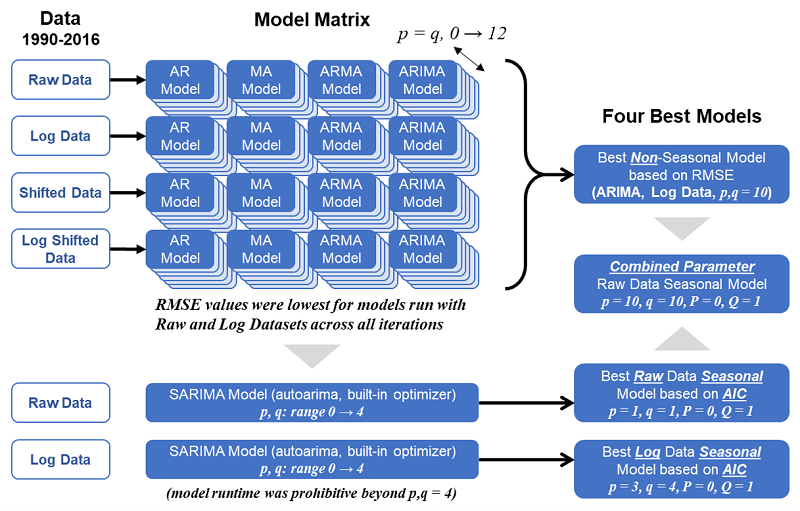
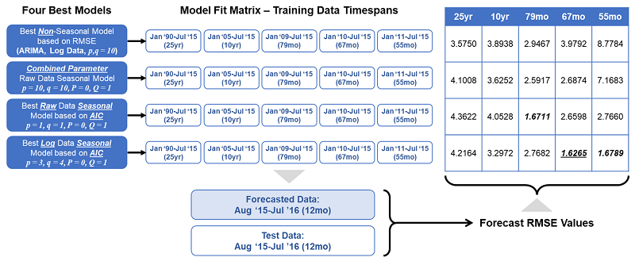

# Forecasting Carbon Emissions
***Using Timeseries Regression Techniques to Predict Greenhouse Gas Emissions***

## Background and Problem Statement
Global warming presents a major challenge to humanity, and in an effort to quantify and forecast it's impacts, greenhouse gas emmissions predictions would be a reuqired input.  Timeseries data were provided for monthly greenhouse gas emmissions from a vareity of fuel sources used for electric energy production in the United States from 1973 to 2016.  The fuel soureces include natural gas, coal, and petroleum among others.  The goal of this project focused on forecasting the carbon diaoxide (CO2) emmisions from electric energy production fueld by natural gas for 12 months beyond the provided data.

## Initial Processing
As the emissions data included a vareity of sources, the natural gas data needed to be extracted into its own data frame for cleaning and pre-processing.  Note, while the attached code will show that all emissions data for the various fuels were plotted, this report will only consider the natural gas emmissions data as they were only emissions this project was tasked with forecasting.  After dropping unecesasry columns, the time data was converted from an integer object to a proper date-time format.  This step revealed that the time data contained a null value between every twleve-month interval, which was quickly determined to coincide with a twelve-month (yearly) emissions sum.  The data corresponding to these null time values were removed as they are not part of a proper timeseries and of no use in forcasting.  A plot of the cleaned natural gas emission sdata is shown below.

****** Insert image opf all emissions data

From the plot, a distinct upward trend in natural gas emmissions can be observed from around 1990 onward that is inconsistent with the previous 17 years of data.  It further appears that this trend is maintained through the end of the data.  It is unknown what caused this to occur, however, it can be speculated the data prior to this event would not be relevent to a forecasting model for a time period beyond the provided data.  Thus, the data used for model fiting and forecasting was taken from 1990 onward.

## Summary of Evaluation and Forecasting Process
* Creating input datasets:  checking for stationarity and establishing transformations 
* Raw emmissions data were decomposed into trend, seasonal and residual componentns ... this wasn't used for anything, maybe to inform ACF / PACF
* Then model functions were made for AR, MA, ARMA, ARIMA, SARIMA
*   Models were iterative swept through p and q
* Inverse transformation functions for Log shift, shift only, log only
* Made single funciton to optimize funcitons by sweeping p and q values together and selecting which type of function it was (not including SARIMA)
  *  Then ran optimizers on all 4 datasets and calcaulated RMSE values to find best models
*  Used auto ARIMA for run a SARIMA model with optimization
*  Combined sarima model with p and q parameters
*  Selected the 4 best models of those run....
*  Created train and validation (test) datasets using the last year of the provided data (note that we say train , but it's actually validation)
  * did this for 1990 onward data
* Then tried fitting the models against different input datasets for different time periods
* Then created averges for everything (but ignored that)
* Plotted 3 best models below RMSE 2, shose lowest RMSE as best model
* Then finally fit the best model

Visually, the data are clearly not stationary, and stationarity is generally required for data 
* examined data stationarity with moving averages and dickey fuller tests
* attempted to remove sataionarity with transformations
* 

****** Add a 2x2 sbplot of all dat transformations

## Models Run

## Performance Evaluations

## Conclusion

# Contact Info
- Email: <a href = "mailto: drossetti12@gmail.com" style="color: red">drossetti12@gmail.com</a>
- LinkedIn: [https://www.linkedin.com/in/daniel-r-10882139/](https://www.linkedin.com/in/daniel-r-10882139/)
- MIT ADSP Certificate:  [https://www.credential.net/0655323a-4a50-49d6-9dfc-a81e5e4b7ca8#gs.o5fack](https://www.credential.net/0655323a-4a50-49d6-9dfc-a81e5e4b7ca8#gs.o5fack)
- MIT ADSP ePortfolio: [https://eportfolio.greatlearning.in/daniel-rossetti](https://eportfolio.greatlearning.in/daniel-rossetti)
