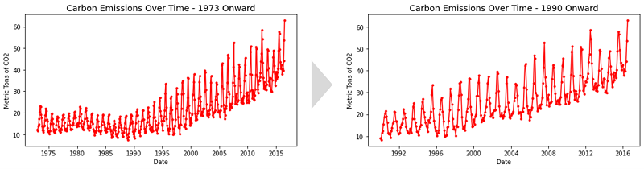
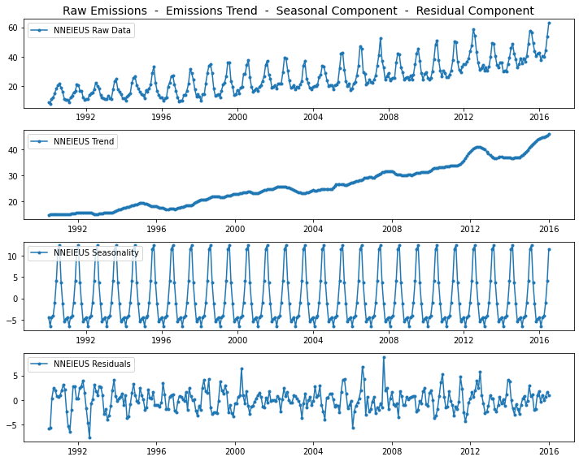
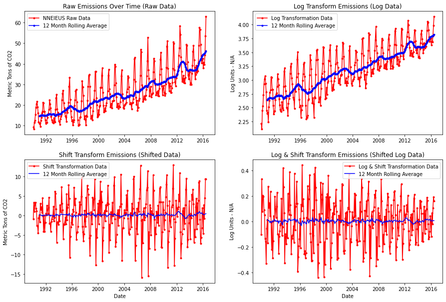
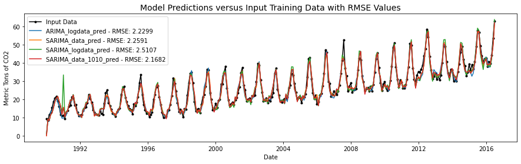
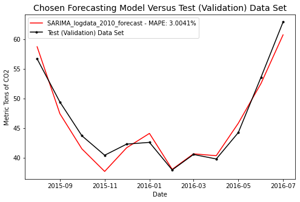
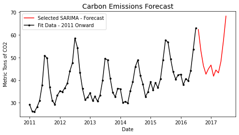

[<< Back to Project Portfolio Website](https://drossds.github.io/Dan_Data_Science_Portfolio/)

# Forecasting Carbon Emissions
***Using Time Series Regression Techniques to Predict Greenhouse Gas Emissions***

## Background and Problem Statement
Global warming presents a major challenge to humanity, and in an effort to quantify and forecast its impacts, forecasts of carbon emissions would be a useful input.  Time series data were provided for monthly greenhouse gas emissions from a variety of fuel sources used for electric energy production in the United States from 1973 to 2016.  The fuel sources include natural gas, coal, and petroleum among others.  The goal of this project focused on forecasting the carbon dioxide (CO2) emissions from electric energy production fueled by natural gas for 12 months beyond the provided data.

## Initial Processing
As the emissions data included a variety of sources, the natural gas data needed to be extracted into its own data frame for cleaning and pre-processing.  After dropping unnecessary columns, the timestamp data were converted from integer data to the proper date-time format.  This step revealed that the time data contained a null value between every twelve-month interval, which was quickly determined to coincide with a twelve-month (yearly) emissions sum.  The data corresponding to these null time values were removed as they are not part of a proper time series and of no use in forecasting.  A plot of the cleaned natural gas emissions data is plotted below (left).

From the plot, a distinct upward trend in natural gas emissions can be observed from around 1990 onward that is inconsistent with the previous 17 years of data.  It further appears that this trend is maintained through the end of the data.  It is unknown what caused this to occur, however, it can be proposed that data prior to this event would not be relevant to a forecasting model beyond this event.  Thus, the data used for model fitting and forecasting was taken from 1990 onward (see right plot above).

## Exploratory Data Analysis
Exploratory data analysis focused primarily on determining the stationarity of the data and examining its seasonal properties.  Visually, the emissions data are clearly not stationary, which is a general requirement for time series regression models.  However, it was determined from some initial model fits that non-stationary data provided much better prediction results (to be discussed later in *Training Data Processing*). The seasonal properties of the data are also visually apparent from the regular 12-month period of oscillation corresponding to the cyclical nature of energy demand throughout the year in the United States with the changing seasons.  Both the stationarity and seasonality were examined using a "seasonal_decompose" function to decompose the emissions dataset their trend, seasonality, and residual components.  The results are provided below, showing the decomposed upward trend in emissions and the 12-month seasonal cycle.

Also included in the exploratory data analysis was the plotting of Autocorrelation and Partial Autocorrelation Functions (ACF) and PACF), and while the intent was to inform the hyperparameter selection process for the regression models, the results were not used in the model optimization process due to a hyperparameter optimization process described later.

## Summary of Model Development Process
The forecasting model development process is described below and presented graphically with the provided flowcharts.  More detailed descriptions are provided in the following subsections.
- It was determined during initial evaluations that the selected transformation for the training data affected the error of the predictions.  Thus, four datasets were created with different transformations applied
- Each of the four datasets was then used to train four varieties of non-seasonal models each optimized against 13 hyperparameter combinations for a grand total of 208 non-seasonal model combinations evaluated.  The best non-seasonal model was identified to be the combination with the lowest Root Mean Square Error (RMSE) of its emissions predictions versus the input emissions data
- An "auto_arima" function with built-in optimization was run against the best two performing datasets from the non-seasonal models ("Raw Data" and "Log Data"), and the function output two corresponding best-performing models based on the AIC metric (which is the built-in optimization metric for the "auto_arima" function)
- A final hybridized-parameter seasonal model was created by combining the best performing dataset and hyperparameters across all models

- A validation dataset was then crated from the last 12 months of the provided emissions data.  All four models were then used to forecast the emissions during this period using five subsets of the remaining emissions data to create training datasets of five different timespans from the prior 25 years, 10 years, 79 months, 67 months, and 55 months of emissions data.  The forecast errors were then calculated for each of the 20 model and timespan combinations to select the final model

### Training Data Processing
The general rule is that the training data used to fit regression models must be stationary for the model to make a proper prediction.  However, it was determined during initial investigations that the non-stationary datasets actually produced the lowest-error predictions.  From this, four input datasets were created with various combinations of transformations to be run through all models (explained in further detail below) so that the datasets could be compared and the best transformation method(s) selected.
- ***Raw Data***:  Untransformed natural gas emissions data in its "raw" form after having been cleaned and formatted as described previously
- ***Log Data***:  The Raw Data with a log transformation, attempting to achieve stationarity
- ***Shifted Data***:  Raw Data which has been "shifted" by taking the difference between successive data point; effectively, the derivative of the dataset
- ***Log Shifted Data***:  Log-transformed Raw Data which was then "shifted" as described above
Of the four datasets above, only "shifted" datasets achieved stationarity as determined by an Augmented Dickey-Fuller (ADF) test.  As stated previously, stationarity had a negative impact on the model performance as will be explained in the next section.  The four datasets are plotted below.

### Fitting and Optimizing Non-Seasonal Regression Models
Four model varieties were created including:
- Autoregressive (AR) Models
- Moving Average (MA) Models
- Autoregressive Moving Average (ARMA) Models
- Autoregressive Integrating Moving Average (ARIMA) Models

Each of these four models were trained against all four datasets above, creating a combination of 16 model-dataset combinations.  Additionally, the *p* and *q* hyperparameters present in each of these model combinations were swept through the values 0 through 12 with *p* and *q* being equal in all cases to limit computation time by limiting total hyperparameter combinations to just 13.  Thus, each of the 16 model-dataset combinations was run with hyperparameters *p* and *q* set equal through the values 0 - 12 for a grand total of 208 individual model-dataset-hyperparameter combinations.   Each combination was fit to the input training datasets, and their predictions were compared against the actual emissions from the training data time period (1990 onward).  Root Mean Square Error (RMSE) values were then calculated for each model and are reproduced in the table below with a color gradient applied showing the range of higher RMSE values (red) and lower RMSE values (blue).

From error outputs, two important conclusions can be drawn:
- Both shifted datasets produced much higher-error predictions, and the non-stationary datasets were providing much better predictions
- The model with the lowest error was an ARIMA model accepting the log-transformed data ("Log Data") with *p* = *q* = 10

### Fitting and Optimizing Seasonal Models
Using the auto_arima function from pmdarima, Seasonal ARIMA (SARIMA) models were created and optimized within the function, and the best performing model was output (as evaluated against AIC values).  From the above conclusion regarding stationarity data, auto_arima was only run with the raw and log-transformed datasets.  Within this function, the starting and maximum hyperparameter values were selected to limit the number of hyperparameter combinations evaluated by the optimizer.  After some trial-and-error, it was determined that non-seasonal hyperparameters *p* and *q* would be run between the values 0 and 4 as ranges larger than this were prohibitively time-intensive.  The best model parameters for each dataset were then output and the RMSE values of their predictions against the training data were calculated in the same fashion as the non-seasonal models.  In an attempt to create an even more accurate model, a final model was then specified combining the parameters from the best seasonal and non-seasonal models.  The RMSE values and parameters for all four models are shown in the table below with all non-seasonal (*p*, *d*, *q*) and all seasonal (*P*, *D*, *Q*, *M*) hyperparameters listed:

| Model Name | Type | Input Dataset | *p* | *d* | *q* | *P* | *D* | *Q* | *M* | RMSE |
| ---------- | ---- | ------------- | :-: | :-: | :-: | :-: | :-: | :-: | :-: | :-:  |
| ARIMA_logdata| ARIMA | Log Data   | 10  |  1  | 10  | N/A | N/A | N/A | N/A | 2.2299|
| SARIMA_data| SARIMA | Raw Data    | 1   |  1  | 1  | 0 | 1 | 1 | 12 | 2.2591 |
| SARIMA_logdata| SARIMA | Log Data    | 3   |  1  | 4  | 0 | 1 | 1 | 12 | 2.5107 |
| SARIMA_data_1010| SARIMA | Raw Data    | 10  |  1  | 10 | 0 | 1 | 1 | 12 | 2.1682 |

*Table Notes:*
- N/A values indicate that the seasonal parameters were not applicable inputs for the non-seasonal ARIMA model
- Values for *d* and *D* were set to 1 to indicate that the models were integrating
- Values for *M* were set to 12 as the seasonal models require the period of seasonality as an input
- Exploring additional values for *d*, *D*, and *M* was not considered due to time limitations

A comparison of the predictions from each model to the actual training emissions data are plotted below:

### Training Data Timespan and Final Model Selection
For time series data, the most recent data often have the greatest impact on the model forecasts as much older data may be far less relevant to current trends and negatively impact model accuracy. Thus, evaluating the effects of the training data's starting point on the prediction accuracy was required to determine the proper timespan of data on which the model should be trained.  

The training data used previously were split into a validation (test) dataset which contained the most recent 12 months of emissions data (Aug-2015 - Jul-2016), and five different training data subsets with different timespans (25 years, 10 years, 79 months, 67 months, and 55 months).  Each of the four models above was then fitted against the five training data subsets, and used to forecast the most recent 12 months of emissions data (Aug-2015 - Jul-2016).  The root mean square error between the forecasted emissions and the actual emissions (validation dataset) were then calculated for each model-timespan combination to determine which produced the most accurate forecasts.  This process was shown earlier, but is provided again for clarity.

The model-timespan combination with the lowest RMSE value was found to be the "SARIMA_logdata" model with the 67-month training data timespan.  Its Mean Average Percent Error (MAPE) against the validation dataset was calculated. The error and forecast of the final model are shown in the plot below:

Based on the validation dataset, the predicted model error that would be observed against the test data is approximately 3%.

## Forecasting Beyond the Provided Data
With final model variety, training data transformation technique, training data timespan, and hyperparameters selected, the natural gas emissions were forecasted 12 months beyond the provided data.  A final training dataset was created from the most recent 67 months of the provided emissions data, and the forecasted carbon emissions are shown in the plot below.

## Conclusions:
The conclusions of this report are outlined as follows:
- A variety of seasonal and non-seasonal regression models were optimized in combination with the transformation methods of the training data
- The four best models with the lowest Root Mean Square Error (RMSE) were then selected to be further evaluated based on their ability to forecast the last year of the provided emissions data
- The effects of five training data timespans on each of the four best models were examined to determine which model and timespan combination produced a forecast with the lowest error
- The best combination with the lowest RMSE was selected and determined to have Mean Average Percent Error (MAPE) of approximately 3% when forecasting the last 12 months of provided emissions data (the validation dataset)
- The best model was a Seasonal Autoregressive Integrating Moving Average (SARIMA) model trained against the most recent 67 months of log-transformed emissions data
- The final model was then employed to forecast the carbon emissions from natural gas electric energy production 12 months beyond the provided emissions data
- It can be seen that the upward emissions trend and seasonality are maintained in the forecasted data

# Contact Info
- Email: <a href = "mailto: drossetti12@gmail.com" style="color: red">drossetti12@gmail.com</a>
- LinkedIn: [https://www.linkedin.com/in/daniel-r-10882139/](https://www.linkedin.com/in/daniel-r-10882139/)
- MIT ADSP Certificate:  [https://www.credential.net/0655323a-4a50-49d6-9dfc-a81e5e4b7ca8#gs.o5fack](https://www.credential.net/0655323a-4a50-49d6-9dfc-a81e5e4b7ca8#gs.o5fack)
- MIT ADSP ePortfolio: [https://eportfolio.greatlearning.in/daniel-rossetti](https://eportfolio.greatlearning.in/daniel-rossetti)

  
[<< Back to Project Portfolio Website](https://drossds.github.io/Dan_Data_Science_Portfolio/)
